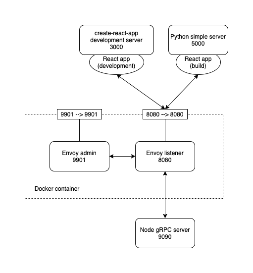

# grpc-web-hello

This project started out as a recreation of [grpc-web's hello world example](https://github.com/grpc/grpc-web/tree/master/net/grpc/gateway/examples/helloworld).

## Requirements

- node and npm
- docker
- protoc
- protoc-gen-grpc-web

## Architecture

The architecture of the project is as follows. All the configuration is specified by the configuration files and the bash scripts.



## Development

Install dependencies `$ npm run install:dependencies`

Start the gRPC server `$ npm run dev:server`

Build the docker image and spin up the envoy proxy in a container
```
$ docker build . \
    -t grpc-web-hello:latest \
    -f ./envoy.Dockerfile
$ docker run -d \
    -p 8080:8080 \
    -p 9901:9901 \
    grpc-web-hello:latest
```

In another terminal, start the gRPC client's development server `$ npm run dev:client`. This will spin up a development server for the client-side code.

The client code depends on the [`@mebble/grpc-hello-client`](https://www.npmjs.com/package/@mebble/grpc-hello-client) npm package, which wraps over the gRPC client stubs generated from the protobuf files in the `proto` directory. That package has its source code in the `grpc-hello-client` directory of this project. So when the protobuf files are updated, the `@mebble/grpc-hello-client` package needs to be rebuilt and republished.

## Building

First, start the gRPC server that the client will connect to.
```
$ npm run start:server
```

Build the client.
```
$ npm run build:client
```

All the above steps could be performed in one command using:
```
$ npm run start:production
```

`$ npm run build:client` bundles up the client code into the `build` directory. To run this bundled code in the browser, host it statically using a simple web server, such as the Python `http.server` module:
```
$ python3 -m http.server --directory build 5000
```
